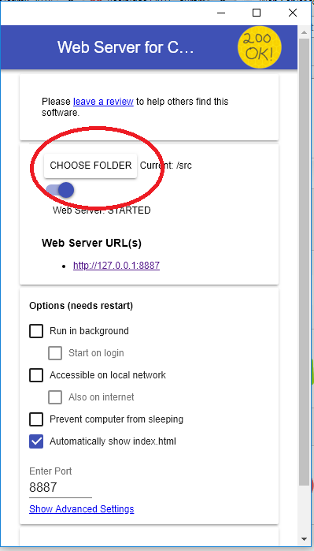
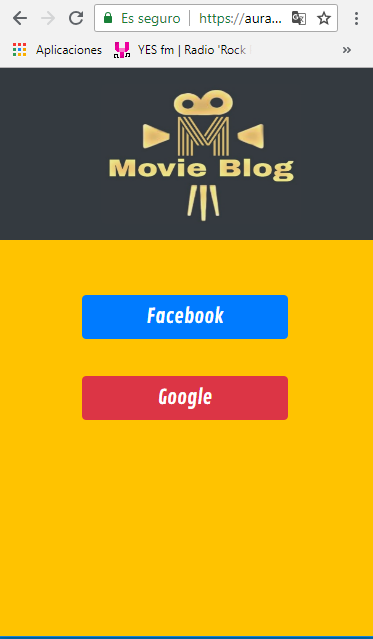
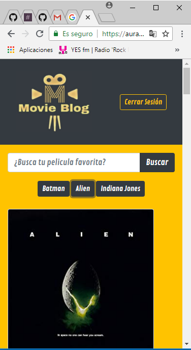

# Movie Blog

## Descripción

Movie Blog, consiste en un blog que permite mostrar las peliculas o series de tu elección, mostrando el poster, año y tipo de la misma.

Este proyecto se realizo para reforzar mis habilidades tecnicas, llamando a una Api relacionada con la industria cinematográfica. 

Para accerder se tiene que iniciar sesión a traves de las redes sociales ya sea con Facebook o Google.
Una vez logeado aparecera la pantalla principal de la app Web en la que aparece un buscador donde escribiras tu pelicula favorita o serie, mostrandote la informacion rescpectiva de cada pelicula.

También se encuentra con tres botones de busquedas especificas, para acceder a una manera mas rapida y eficaz al contenido.

## Proceso de instalación

-Local
  - Abrir la consola y escribir npm install
  - Descargar de este repositorio el Movie Blog
  - Ejecutar npm install serve dentro de la carpeta descargada
  - Ejecutar serve . la url que te arroja : http://localhost:5000
  - Ejecutar el localhost en el navegador y buscar el index.html de la aplicación
  - Disfrutar de la app Web

-Web Server for Chrome (servidor)
  - Entrar ha este link [Servidor](https://chrome.google.com/webstore/detail/web-server-for-chrome/ofhbbkphhbklhfoeikjpcbhemlocgigb)
  - Instalar la extensión en el navegador de Chrome
  - Abrir la extension y en la opción de CHOOSE FOLDER seleccionar la carpeta del repositorio descargado, y   
    ejecutar el index.html
  - Disfrutar de la app Web 

  

-Web (Internet)
- Abrir el siguiente link [Movie API](https://auramelisa01.github.io/cdmx20181-Track-FE-themovieapi/src/index.html)
- No se necesita instalar nada !Disfruta tus movies o series favoritas

 
## Alcance 1

- Obtener un API Key en [OMDB API](http://www.omdbapi.com/)
. Tendrás que entrar a la sección “API Key”, registrarte en
“Free” y obtener tu llave para poder consumirla.

- Leerás la documentación y armarás la URL para poder ejecutar las llamadas. Con ello, obtendrás los datos de 3 colecciones cinematográficas.
Puedes usar como búsqueda “Game of Thrones”, “Batman”, “The Crown”, "Wonder Woman", etc.

Ejemplo:

`http://www.omdbapi.com/?apikey=5f1d2a9e&s=Batman&plot=full&type=series`

- Programarás una función `getMovies` en el entorno global que retorne la colección de películas a partir de un string de búsqueda en el API de
OMDB. Recuerda incluir tu API Key también en la función para que puedas acceder a los datos.

### Argumentos:

- *api.* String que incluye tu llave principal de acceso al API
búsqueda.
- *search.* String que incluye las palabras a buscar en base de datos. 

### Retorno:
Un arreglo de objetos. Cada objeto incluye los valores de la película respectiva.

## Alcance 2

- Elegirás 3 series/colección de películas y crearás una aplicación que muestre sus datos en una página principal. Utiliza tu función getMovies para
requerir los datos.
- Desarrollarás una vista principal donde se muestre:
  - Navegación. Incluye el nombre del blog.
  - Categorías. Incluye las colecciones de películas.
  - Poster y título. Incluye el poster individual de la película y su título respectivo.

## Alcance 3

- Al darle click a un poster, te lleva a su descripción individual. Puedes crearlo a través de un modal o con una vista
nueva. Es tu elección.

## Alcance 4

- Consideras integrar autenticación a la plataforma para comenzar tu comunidad. Esto significa que una persona pueda hacer su “login”
dentro de tu aplicación a través de una red social.  Puedes utilizar Firebase como herramienta para lograrlo.

